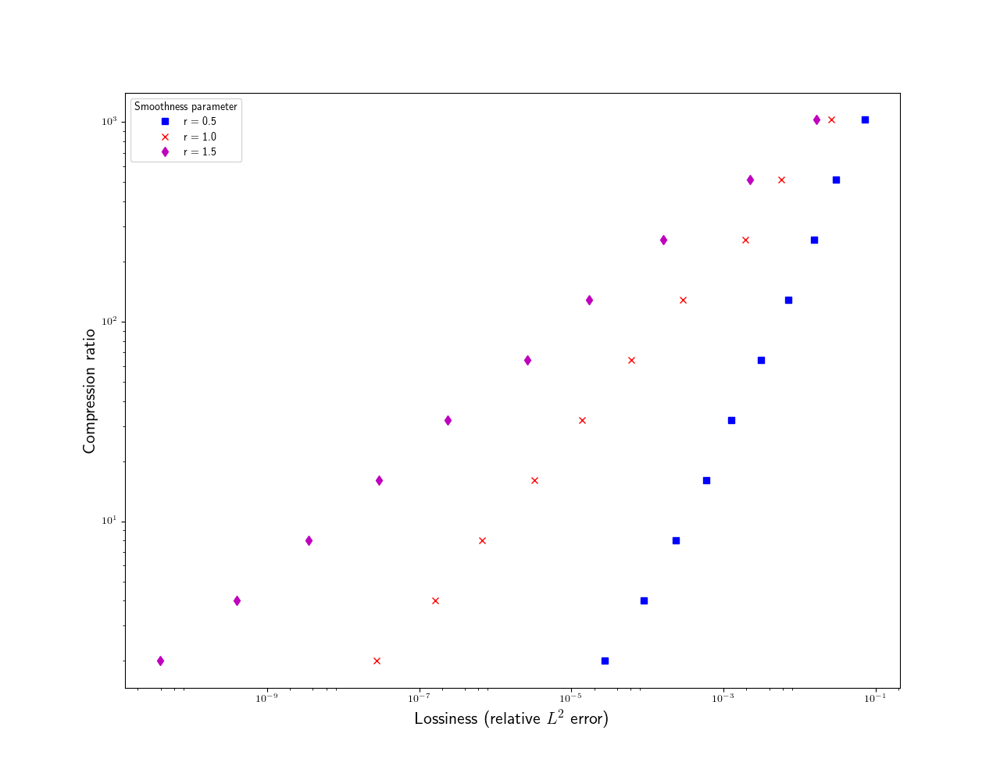
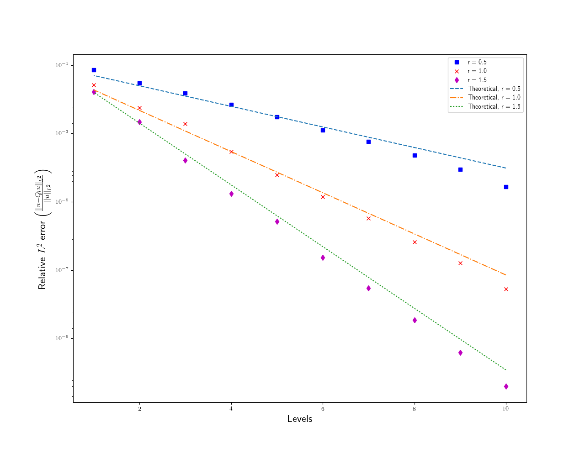

# example_brown_data
Sample datasets from Brown. These datasets are created to prescribed smoothness parameters. Smoothness parameters (r) of 0.5, 1.0, 1.5 are presented. The data files are in Adios format.

Sample output from bpls:
```
 double     data                       {8388609, 1}
 double     smoothness_parameter       scalar
 long long  size                       scalar
 byte       /__adios__/timer_labels_1  {8, 16}
 double     /__adios__/timers_1        {1, 8}*
```


Compression ratio vs lossiness, and relative error plots are also available.



